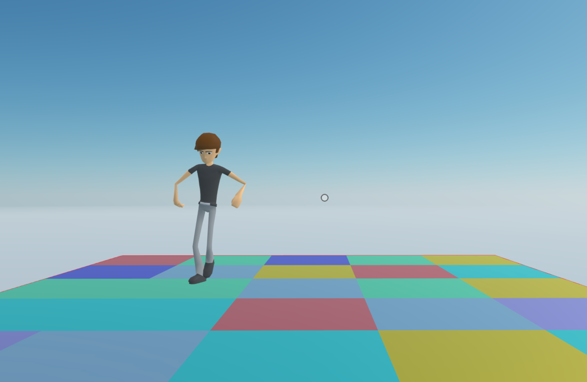

# Dance floor

A scene with animations, sound, and tiles on the floor that randomly change color to the beat.




This scene shows you:

- How to play a local audio file
- How to add a 3D model
- How to play animations from a 3D model
- How to change the materials on a primitive shape
- How to handle synchronized changes of several entities through a system
- How to create custom components 
- How to use group of entities that have a specific component

## Try it out

**Install the CLI**

Download and install the Decentraland CLI by running the following command inside this scene root directory:

```bash
npm install @dcl/sdk@next
```

**Previewing the scene**

Inside this scene root directory run:

```
dcl start
```

## Copyright info

This scene is protected with a standard Apache 2 licence. See the terms and conditions in the [LICENSE](/LICENSE) file.
