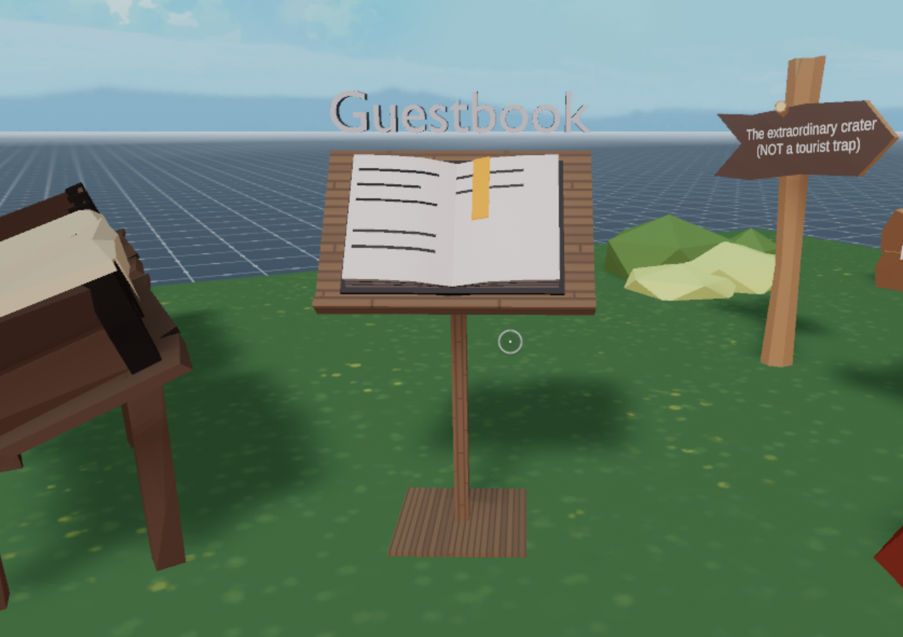

# Guest book

Sign a guestbook. Signatures done on the guestbook are stored in a SQLite file. The code for the server is included in the `/server` folder of this repo. It also implements a few security checks to ensure that the requests that arrive to the server are legitimate.



Check out the [related tutorial](https://decentraland.org/blog/tutorials/servers-part-2/)!

This scene shows you:

- How to send HTTP requests to an API to store data in a permanent place, so others can then retrieve changes
- How to display a custom UI
- How to parse a JSON response from an API call
- How to parse a string so that it fits a maximum line length and maximum number of lines
- How to fetch the player's UserId


Every time the book is opened, a request is sent to a RESFful API that this server exposes, to fetch all existing signatures. When a new signature is made, another request is sent to that API, including the player's name and id, to add to the database.

## Try it out

**Previewing the scene**

1. Download this repository.

2. Open the command line and navigate to this scene root directory

3. Run:

```
npm install
```

3. Open a Visual Studio Code window on `scene` directory. Not on the root folder of the whole repo, but instead on this sub-folder that belongs to the scene.

4. Open the Decentraland Editor tab, and press **Run Scene**

Alternatively, you can use the command line. Inside `scene` directory run:

```
npm run start
```

**Scene Usage**

Click on the guestbook to open the UI and fetch all the signatures on the book. You can flip through the pages by clicking the arrows on the sides. If you click the sign button, your user ID will be fetched and added to the list of signatures. If you run this on preview, you will be using the randomly generated `guest` UI used by preview.

Since you're running the scene locally on localhost, the validations that relate to the request's origin and on querying the catalyst servers are turned off. Turn them on with the `TESTS_ENABLED` flag, on `securityChecks.ts` in the server folder. Notice that once that's enabled your requests from localhost will no longer pass the validations.

By copying the `security` folder in `server`, you can use the same set of security validations on any request that was originated with `signedFetch()` in a Decentraland scene.

Simply run:

```ts
await runChecks(req)
```

Or add a set of coordinates to also validate the request's origin on the map:

```ts
await runChecks(req, VALID_PARCEL)
```

## More About Validating Player Authenticity

On the scene:

- Send requests with `signedFetch`, to include headers with an ephemeral key signature in the request.

On the server:

- Check that the origin of the request, to ensure it's from a Decentraland domain
- Filter out malicious IPs that were manually identified
- Check that the headers included in the `signedFetch` are properly signed, ensuring also that the timestamp in the signature is also recent and that the ephemeral key corresponds to the player's address.
- Query the catalyst server that the player claims to be in, and ensure that the player is truly there.
- Check that the player's location when sending the request is at a specific parcel, or within a margin or error of that.

These checks together ensure that a request needs to come from inside decentraland, from a player in a deployed scene within the specified coordinates.

Through all of these checks, you can make it very hard for anyone who might want to take advantage of your scene. These security measures are especially valuable in scenes that give away tokens, or where there's some kind of monetary incentive for cheating.

### About the ephemeral key

When players log into decentraland, they sign a message using Metamask or their preferred web3 client. This signature is used to generate an ephemeral wallet that exists during that session, this address can be traced back to the player's original address. The advantage is that it can be used by the Decentraland explorer to sign messages behind the curtains, without requesting that the player manually signs every request.

When you use the `signedFetch()` function in a scene, you're sending additional metadata in the request's headers, that includes a signed message encrypted with the ephemeral key. This signed message includes a timestamp, the player's position on the map, the player's actual address, and the contents of the request itself.

### Configurable properties

The following properties can be configured on `securityChecks.ts`:

- `TESTS_ENABLED`: If true, requests from localhost are allowed. If false, the server also enforces that the requests come from a decentraland domain, and validates with a catalyst server that the player is currently there.

- `MARGIN_OF_ERROR`: Make the location checks more or less permissive. A margin or error of 2 will allow locations at + - 2 parcels of distance on either axis from the indicated location.

- `denyListedIPS`: Add any IPs to this list that you want to block from making any requests.

## Copyright info

This scene is protected with a standard Apache 2 licence. See the terms and conditions in the [LICENSE](/LICENSE) file.
