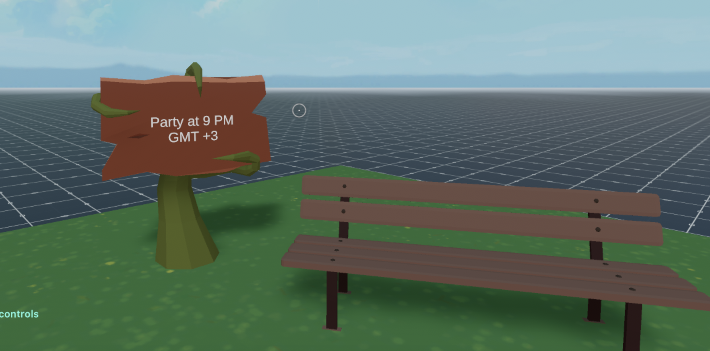

# Party time (SDK7 Version)

  

This simple scene calls a time API to fetch the current time. If the time is between 9:00 PM and midnight in GMT+3, a party starts.

  



  

This scene shows you:

- How to send requests to an API

- How to parse a JSON response

- How to handle async functions, waiting for an external response

- How to stream audio

- How to stream video, and display it as a texture on primitive shapes

  

The RESTful API called is `https://worldtimeapi.org/api`, which returns a JSON file with several fields that can be read.

If you want to change the streaming server you have to update the permission in scene.json
  

## Try it out

  

**Install the CLI**

  

Download and install the Decentraland CLI by running the following command:

  

```bash

npm  i  -g  decentraland

```

  

**Previewing the scene**

  

 1.  Download this full repository from  [sdk7-goerli-plaza](https://github.com/decentraland/sdk7-goerli-plaza/tree/main), including this and several other example scenes on SDK7.
 2.  Install the  [Decentraland Editor](https://docs.decentraland.org/creator/development-guide/sdk7/editor/)
 3.  Open a Visual Studio Code window on this scene's root folder. Not on the root folder of the whole repo, but instead on this sub-folder that belongs to the scene.
 4.  Open the Decentraland Editor tab, and press  **Run Scene**

Alternatively, you can use the command line. Inside this scene root directory run:

```bash

npm  run start

```
  

**Scene Usage**

  

Once the party starts, the scene starts streaming audio from an internet radio, and applies video textures from a video stream to spinning cubes.

  
  
  

Learn more about how to build your own scenes in our [documentation](https://docs.decentraland.org/) site.
 

## Copyright info

  

This scene is protected with a standard Apache 2 licence. See the terms and conditions in the [LICENSE](/LICENSE) file.