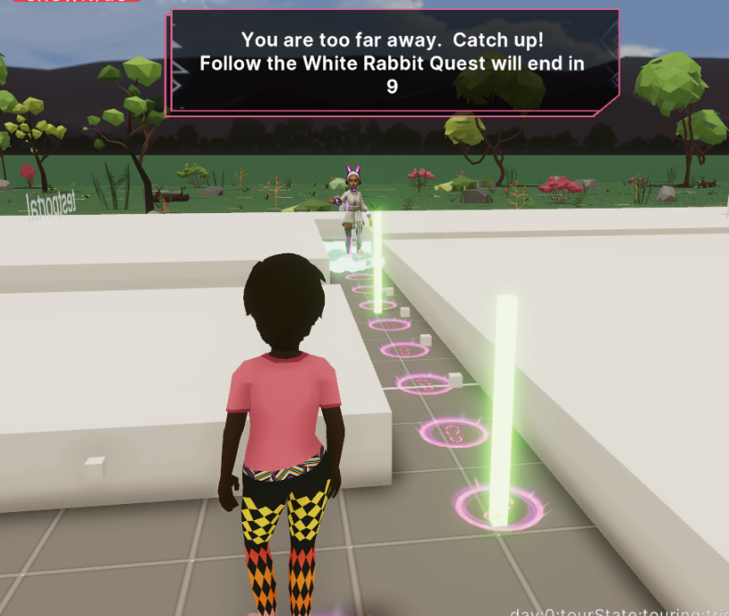

# NPC Tour Using A* Search Algorithm (SDK7 Version)



Use A* Search algorith to help guide the NPC choose from 2 modes.   

NPC find player where the NPC will avoid obsticles and seek out the player.

NPC Tour where the NPC will give the player a tour avoiding obsicles along the way.  The NPC will never move further than a defined distance away.  If the player strays too far breadcrumbs appear to direct player back to NPC.

# Configuration

/helpers

grid-template.csv - is this examples obsticles

scene-plot-helper.html - is a tool for generate grids for astar 

/src/config.js

See Debug Markers such as grid markers, boundary top/bottom, obstacles, seek and prediator entities

```
sizeTourXParcels:number //width of a* grid
sizeTourZParcels:number //depth of a* grid

DEBUG_2D_PANEL_ENABLED:boolean = //2d debug panel visible
DEBUG_UI_ANNOUNCE_ENABLED:boolean = //use ui.DisplayAnnounce for key events
  
DEBUG_SHOW_NPC_PATH:boolean //if npc path is lit up
DEBUG_SHOW_ASTAR_OBSTICLES :boolean //if obsticles are visible

TEST_CONTROLS_ENABLE = true //if 2d debug buttons for testing visible
```

/src/npc-tour/tourConstants.ts

```
//general config
CELL_WIDTH:number //how wide each grid is
NPC_ACTIVATE_DISTANCE:number//distance npc will engage/talk to player

roadsArray:number[][]//2d array for traversable path
pathSeedPointsAbs:number[][]//2d array of 2 dimensional points of interest for the tour

//Tour mode
NPC_MAX_AWAY_DISTANCE:number //max distance away npc will get
NPC_ACTIVATE_BREADCRUMB_DIST:number //what to activate breadcrumb
NPC_TOO_FAR_AWAY:number// player too far from NPC to continue tour


//Find player mode
NPC_FIND_PLAYER_RECALC_DIST:number//distance find player will recalculate
NPC_FIND_PLAYER_TO_START_MIN_DIST:number//how close npc needs to get to player to stop walking
```

/src/npc-tour/tourSetup.ts

Set up tour per day.   segmentsAbs is a 2d array where you list a series of 2d coordinates for the NPC to traverse

```
const DAY_PATHS:DayPathData[] = [
  {
    day:0, //day
    isEventDay:true,
    currSegment:0, 
    segmentsAbs:[ //segments to travel
      [
        [16,8] //start at mainstage south east side (lower right)
        ,[21,7],[21,2],[14,2],[14,8],[9,8],[5,8]//around ozzfest 
      ], //run to/from
      //[] //run to/from
      [ 
        [5,17],[6,17],[18,17],[18,21]//,[-53,67]//all the way to top
      ]
    ],
    segmentsRel:[
 
    ],
    completed:false,
    dropLootBox: true,
    portals:{},
  },
```


## Try it out

**Install the CLI**

Download and install the Decentraland CLI by running the following command:

```bash
npm i -g decentraland
```

**Previewing the scene**

Open this folder on the command line, then run:

```
dcl start
```

Any dependencies are installed and then the CLI opens the scene in a new browser tab.

## Deploy to Decentraland

If you own any parcels of land in Decentraland, or have permissions to deploy to someone else's, you can publish this project.

1. Make sure the scene parcels in `scene.json` match those you own or have permissions on.
2. Run `dcl deploy` on the project folder
3. This will open a browser tab to confirm. Metamask will prompt you to sign.
   > Note: Make sure you are using the wallet that owns the parcels or has permissions.


## Resources

Learn more about how to build your own scenes in our [documentation](https://docs.decentraland.org/) site.

Find more example scenes, tutorials and helper libraries in the [Awesome Repository](https://github.com/decentraland-scenes/Awesome-Repository).

If you need any help, join [Decentraland's Discord](https://dcl.gg/discord), where you'll find a vibrant community of other creators who are eager to help. You're sure to find help in the #SDK support channel.

## Copyright info

This scene is protected with a standard Apache 2 licence. See the terms and conditions in the [LICENSE](/LICENSE) file.

## Acknowledgements

Code here is an adaptation of [https://github.com/sbfkcel/fast-astar](https://github.com/sbfkcel/fast-astar)


fast-astar has standard MIT licence. See the terms and conditions in the [LICENSE]

