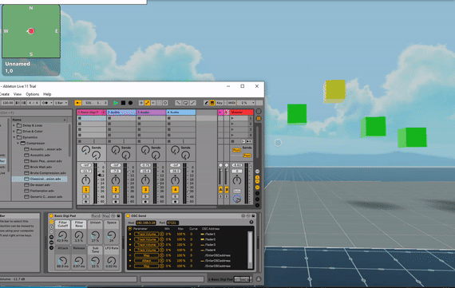

# SDK7 Relay OSC messages to Decentraland

## Try it out

**Previewing the scene**

1. Download this repository.

2. Install the [Decentraland Editor](https://docs.decentraland.org/creator/development-guide/sdk7/editor/)

3. Open a Visual Studio Code window on this scene's root folder. Not on the root folder of the whole repo, but instead on this sub-folder that belongs to the scene.

4. Open the Decentraland Editor tab, and press **Run Scene**

Alternatively, you can use the command line. Inside this scene root directory run:

```
npm run start
```




This project relies on 3 parts:

- A browser app that can receive OSC messages from any source (_linker-app_)
- A Colyseus server that gets sent these messages over webSockets (_server_)
- A Decentraland scene that receives these messages and updates positions of entities accordingly (_scene_)

You can generate OSC messages with many different sources, some examples:

- OSCHoop Mobile app
- Ableton Live + Connection Kit
- Leap Motion + Ableton Live + Connection Kit

## Instructions

### Run locally

- 1. Open a console on the `server` folder
- 2. Run `npm run build`, then `npm run start` in server's folder to start the Colyseus local server
- 3. Open a second console window on the `linker-app/browser-oscjs` folder
- 4. Run `npm install` to install all the project dependencies.
- 5. Run `node .` to start the OSC relayer (no need to open the app in a browser window, it does all it needs to do from the console)
- 6. Check the IP and port that the OSC relayer is listening on. Hook any external services to this same address, make sure it's connected on the same local network.
- 7. Open a third console window in `scene`
- 8. Run `npm run start` to start running the scene locally

> Note: The server and scene expect messages with the following addresses: `/fader1`, `/fader2`, `/fader3`, `/fader4`, all with values between 0 and 1.

### Try it in-world

- 1. Open a console window on the `linker-app/browser-oscjs` folder
- 2. Run `npm install` to install all the project dependencies.
- 3. Run `node .` to start the OSC relayer (no need to open the app in a browser window, it does all it needs to do from the console)
- 4. Check the IP and port that the OSC relayer is listening on. Hook any external services to this same address, make sure it's connected on the same local network.
- 5. Open a browser tab to visit Decentraland at coords [-81,-49](https://play.decentraland.org/?position=-81%2C-49&realm=fenrir-amber)

> Note: This might not work if someone else is already acting as Director on this Colyseus server.

> Note: The server and scene expect messages with the following addresses: `/fader1`, `/fader2`, `/fader3`, `/fader4`, all with values between 0 and 1.

### How this works

1. The OSC Relayer app receives OSC messages and forwards these as Websocket messages to the Colyseus server.
2. The Colyseus server then updates its room state based on these messages
3. Scenes that are also connected to the Colyseus server get updated as the room state changes

In each Colyseus room, there can be only one "Director" user. This user is the one that sends all the changes, all other players just listen. The OSC relayer is connected as a director, sending a password together with the request to connect. Players who connect to the server via Decentraland join as audience, and have no means to affect the room state by themselves.

If a Colyseus room doesn't have a director assigned, it will listen to messages shared between rooms, using the `presence` functionality of Colyseus. In this way, a single Director can reach all rooms and affect all realms of Decentraland, without being limited to the room limits of Colyseus nor the realm limits of Decentraland.

## Using Colyseus SDK with Decentraland

Install `colyseus.js`:

```
npm install --save colyseus.js
```

Add `colyseus.js` to your `"bundleDependencies"` in your `package.json`:

```json
  "bundleDependencies": [
    "colyseus.js"
  ]
```

To avoid TypeScript compilation errors you'll need to edit `tsconfig.json`, and include a few `///<reference` to your source-code, as you can see in the [scene/src/connection.ts](scene/src/connection.ts) file.

```json
{
  "compilerOptions": {
    // ...
    "noLib": false
    // ...
  }
}
```

```typescript
///<reference lib="es2015.symbol" />
///<reference lib="es2015.symbol.wellknown" />
///<reference lib="es2015.collection" />
///<reference lib="es2015.iterable" />

import { Client } from 'colyseus.js'
```

> The Colyseus SDK requires a few TypeScript libraries that are excluded by default by Decentraland.

---

## Creating a Colyseus server:

```
npm init colyseus-app ./server
```

## Deploying to [Colyseus Arena](https://www.colyseus.io/arena)

```
npm run build
```

Upload the `lib` folder from the Arena control panel.

## More

Learn more about how to build your own scenes in our [documentation](https://docs.decentraland.org/) site.

If something doesn’t work, please [file an issue](https://github.com/decentraland-scenes/Awesome-Repository/issues/new).

## Copyright info

This scene is protected with a standard Apache 2 licence. See the terms and conditions in the [LICENSE](/LICENSE) file.
