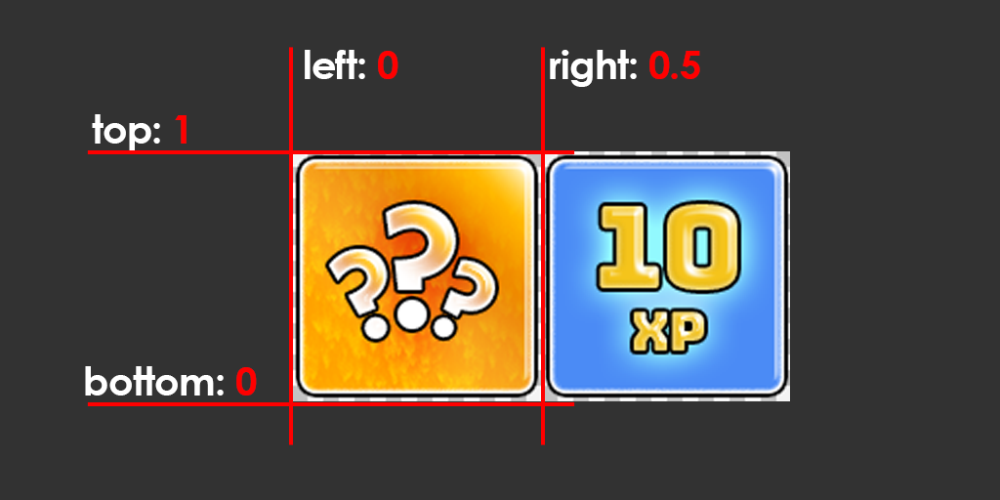
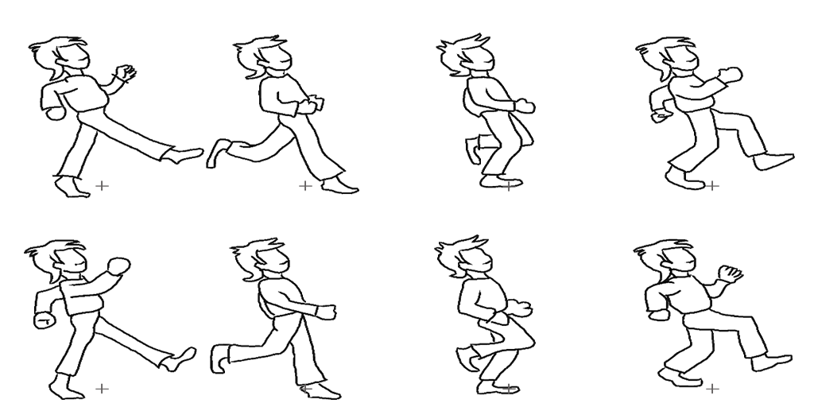
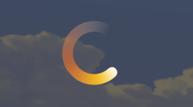
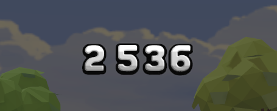
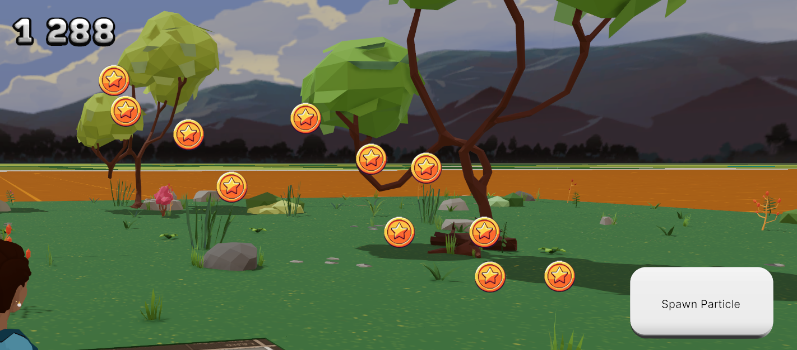
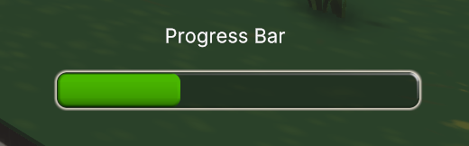

# SDK7 UI Animations Examples

## Try it out

**Previewing the scene**

1. Download this repository.

2. Install the [Decentraland Editor](https://docs.decentraland.org/creator/development-guide/sdk7/editor/)

3. Open a Visual Studio Code window on this scene's root folder. Not on the root folder of the whole repo, but instead on this sub-folder that belongs to the scene.

4. Open the Decentraland Editor tab, and press **Run Scene**

Alternatively, you can use the command line. Inside this scene root directory run:

```
npm run start
```

## What's this for

Below are some examples of SDK7 UI's animation capabilities . For more details, see the [Documentation site](https://docs.decentraland.org/creator/).

# How to test these examples

1) You should check out (download) the example scene for GitHub here:

https://github.com/decentraland/sdk7-goerli-plaza

2) Open the sdk7-goerli-plaza folder in VS Code

3) Open a terminal Window in VS Code and navigate to the /ui-animations folder

```jsx
cd ui-animations
```

4) In the ui-animations folder install the required packages for this example:

```jsx
npm install
```

5) After the package installation has finished you can run `npm run start` to see all the examples running in a single scene


# How to use/copy the examples

In order to use the any of the examples in your own project you will need to do the following:

1) Make sure that in your project you have installed the sdk-utils library:

```jsx
npm i --save @dcl-sdk/utils
```

2) Copy the entire `/ui_components` from the ui-animations repo to your projects `src` folder

3) Check any of the sections below to see what to import into your project’s UI code file in order to use each animated UI element.

4) Also make sure that you have the textures in your project’s `images` folder (these can be either your own custom textures, or the ones copied from the ui-animations repo)


###  Sprite from Atlas

Add a single sprite from a larger texture atlas to your UI

1. Add the required imports to your file:

```ts
import { Sprite } from "../ui_components/SpriteAtlas"
import ReactEcs from "@dcl/sdk/react-ecs"
```

2. Anywhere in your UI code add a `<UISprite>` tag, where you can define the image texture’s path and the UV coordinates ( top, bottom, left, right ) of the specific sprite on the texture:

```tsx
<UISprite 
    texture='images/cardFlip/card-atlas.png' 
    top={1} 
    bottom={0} 
    left={0} 
    right={0.5}
    uiTransform={{
        width: 200,
        height: 200,  
        positionType:'absolute',
        position : {top: 100, left: 300}  
    }}
/>
```


###  Sprite Animation
To add a sprite-sheet animation from a texture to your UI first you need to create/download a spritesheet that has a single animation loop and is distributed into even sized cells, like the example here:

1. Add the required imports to your file:
```ts
import {UIAnimatedSprite, SpriteAnimation } from "../ui_components/SpriteAnimation"
import ReactEcs from "@dcl/sdk/react-ecs"
```

2. In your code create a SpriteAnimation object. When creating this object you can define:
- The Sprite Sheet texture
- How many rows is the texture is split into
- How many columns is the texture is split into
- The frame/sec speed of the animation

```ts
let mySprite= new SpriteAnimation("images/spriteAnimation/walk_anim_sprite.png", 4, 2, 20)
```
3. In your UI code add a `<UIAnimatedSprite>` tag and pass along your newly created SpriteAnimation (mySprite in this example):
```tsx
<UIAnimatedSprite 
  spriteAnimator={mySprite} 
  uiTransform={{ 
		width: 120,
    height: 240,
    positionType:'absolute',
    position: { bottom: '15%', left: '28%' }}}        
/>
```


### Spinner Animation
Add a spinner that you can show while something is loading



1.  Add the required imports to your file:
```ts
import ReactEcs from "@dcl/sdk/react-ecs"
import { LoadingSpinner, Spinner } from "../ui_components/LoadingAnimation"
```
2.  Create a Spinner object and set the texture and rotation speed (angles per second):
```ts
let spinner = new Spinner('images/loadingAnimation/loader_static.png', 1000)
```
3. In you UI code add a `<LoadingSpinner>` tag , pass along the spinner object created above and specify the dimensions/placement:
```tsx
<LoadingSpinner 
      spinner={spinner}
      uiTransform={{
          width: 128,
          height: 128,
          positionType:"absolute",
          position: {top: '50%', left:'50%' },
          margin: {left: -128/2, top:-128/2}, // makes it centered around the cursor, by offsetting with half its dimensions
      }}                    
  />
```
4. The spinner object has a `.show()` and a `.hide()` method to handle when to display it:
```ts
spinner.show()
```


### Custom Counter
Create a counter with custom fonts for the number digits:



1.   Create you custom sprite atlas with the digits 0-9:
   - Each number digit should be centered in square grid cells
   - Texture sides should be power of 2
2. Add the required imports to your file:
```ts
import ReactEcs from '@dcl/sdk/react-ecs'
import { UICounter, CustomCounter } from '../ui_components/CustomCounter'
```
3.   Create a CustomCounter object and set :
   - The number of rows of the number sprite-sheet
  - The number of columnsof the number sprite-sheet
  - The pixel resolution of each digit (all digits should be squares in the texture)
  - Alignment of the counter ( ‘left’, ‘right’ or ‘center’)
  - The path to the sprite-sheet texture
    
```ts
export let counter = new CustomCounter( 4, 4, 100, 'center', "images/customCounter/number_sheet.png")
```
4.In your UI code add a `<UICounter>` tag , pass along the CustomCounter object created above
```tsx
<UICounter customCounter={counter}  />
```
5. (optional) To test if the counter is working you can add a quick test system to increate the count:
```ts
export function CounterTestSystem(dt: number) {    
    counter.increaseNumberBy(8)      
}
engine.addSystem(CounterTestSystem)
```


### Animated Button
Quickly create buttons that react with small animations:

1. Add the required imports to your file:
```ts
import ReactEcs, { UiEntity } from "@dcl/sdk/react-ecs"
import { AnimatedButton, UIButton } from "../ui_components/UIButton"
import { Color4 } from "@dcl/sdk/math"
```
2. Create an AnimatedButton object and specify:
- The text label
- The font size
- The font color
- And what should happen when it is clicked
```ts
let buttonSuccess = new AnimatedButton(
    "Right", // text label
    20, // font size
    Color4.Black(), //font color
    ()=>{
				//what should happen when clicked
				//...

				//play the default success buttonpress animation
        buttonSuccess.successAnimation()    
    }
  )
```
3. In your UI code add the `<UIButton>` tag, pass the AnimatedButton object created above and customize the button further if needed:
```tsx
<UIButton 
    button={buttonSuccess}           
    uiTransform={{
        width:'16%',
        height:64,
        positionType: 'absolute',
        position:{left: '34%', bottom: '60%'}            
    }}            
    uiBackground={{
        textureMode:'nine-slices',
        texture: {src: 'images/easingPopup/stone_ui_bg.png'},
        textureSlices: {
            top: 0.42,
            bottom: 0.52,
            left: 0.42,
            right: 0.48
        }
    }}
/>
```
### Animated Popup
Create UI panels that can move and/or scale from one state to the other:

1. Add the required imports to your file:
```ts
import ReactEcs from "@dcl/sdk/react-ecs"
import { UIPopup, UIPopupAnimation } from "../ui_components/UIPopup"
import { Color4 } from "@dcl/sdk/math"
```
2. Create an UIPopup object and specify:

- The starting positions and scale (in %), which is the ‘closed’ state
- The target positions and scale (in %), which will be the ‘open’ state
- And what should happen when it is clicked (default is toggle() between open and closed states

```ts
let popupAnimator = new UIPopupAnimation( 
    {
      startPosX: 98,
      startPosY: 10,
      startScaleX: 10,
      startScaleY: 7,
      endPosX: 78,
      endPosY: 10,
      endScaleX: 20,
      endScaleY: 70,
    },  ()=>{
      popupAnimator.toggle()
  })
```
3. In your UI code add the `<UIPopup >` tag, pass the UIPopupAnimation object created above and customize the panel, or add contents inside:
```tsx
<UIPopup 
  popupAnim={popupAnimator}
  uiBackground={{
    color: Color4.create(1.0, 1.0, 1.0, 0.8),
        textureMode:'nine-slices',
        texture: {src: 'images/easingPopup/stone_ui_bg.png'},
        textureSlices: {
          top: 0.42,
          bottom: 0.52,
          left: 0.42,
          right: 0.48
        }                 
  }}
>
</UIPopup>
```
Note : Any other UI content that you add within the `<UIPopup>` `</UIPopup>` tags will only be visible once the panel is fully open


### Card Flip Animation
You can add a flippable card to the UI and set images for both sides

1. Create an atlas texture with two or more card faces, or create separate textures
2. Add the required imports to your file:
```ts
import ReactEcs, { UiEntity } from "@dcl/sdk/react-ecs"
import { CardFlipAnimation, UICardFlip } from "../ui_components/CardFlip"
import { UISprite } from "../ui_components/UISprite"
```
3. Create a `CardFlipAnimation` object:
```ts
export let cardFlipAnim = new CardFlipAnimation()
```
4. In your UI code add a `<UICardFlip>` tag , pass along the spinner object created above and specify the sprites for both side A and side B of the card:
```tsx
<UICardFlip       
    cardFlipAnimator={cardFlipAnim}
    uiTransform={{
        width:180,
        height: 240,
        positionType:'absolute',
        position: { top: '5%', left: '47%' }
    }}
    sideA={
        <UISprite texture='images/cardFlip/card-atlas.png' 
                top={1} bottom={0} left={0} right={0.5}
                uiTransform={{
                    width: '100%',
                    height: '100%',                                
                }}
        />
    }
    sideB={
        <UISprite texture='images/cardFlip/card-atlas.png' 
                top={1} bottom={0} left={0.5} right={1}
                uiTransform={{
                    width: '100%',
                    height: '100%',                                
                }}
        />
    }
>
</UICardFlip>
```
5. Clicking on the card now flips it back and forth between side A and side B content


### Particle System
Create a particle emitter on the UI and make it spawn and move custom UI elements across the canvas:

1. Add the required imports to your file:
```ts
import ReactEcs, { UiEntity } from "@dcl/sdk/react-ecs"
import { SpriteAnimation, UIAnimatedSprite } from "../ui_components/UIAnimatedSprite"
import { ParticleEmitter } from "../ui_components/UIParticle"
import { AnimatedButton, UIButton } from "../ui_components/UIButton"
import { Color4 } from "@dcl/sdk/math"
```
2. Create an `ParticleEmitter` object
```ts
export let coinEmitter = new ParticleEmitter()
``` 
3. Create an animated sprite that we will use for the individual particles
```ts
let coinSprite = new SpriteAnimation("images/moveAcross/coin-sprite.png", 4,2, 20)
``` 
4.  In your UI code  create a `<UIEntity>` section that covers the area you’ll want the particles to move inside (in the example we use the whole canvas, 100%). Within that UIEnity call the newly created ParticleEmitter’s `generateParticleUI()` function and add any single UI element as a parameter. The UI element you pass to this function will be repeated on every particle spawned by the emitter.
```tsx
UiEntity
    uiTransform={{
      width:"100%",
      height: "100%"               
    }}      
  >
    {coinEmitter.generateParticleUI(
      <UIAnimatedSprite 
          spriteAnimator={coinSprite} 
          uiTransform={{
          width: '100%',
          height:'100%',
          positionType:'absolute'
          }}
      />        
    )}      
</UiEntity>
```
5. (optional) Test the emitter by adding a button to spawn particles:

- The emitter’s **spawnSingle(startPositionX, startPositionY, endPositionX, endPositionY)** function will spawn a single particle and move it from the start position to the end position passed as parameters. The particles will follow a slightly curved and random motion path towards the endPosition.

- Create a `AnomatedButton` obejct and add the `coinEmitter` 's `spawnSingle()`  to the button's click action. Set the spawn position and the target position as parameters `spawnSingle(startPosX, startPosY, endPosX, endPosY)`
```ts
let buttonSpawn = new AnimatedButton(
    "Spawn Particle",
    20,
    Color4.Black(),
    ()=>{
        buttonSpawn.successAnimation() 
        coinEmitter.spawnSingle(64,80,50,10)   
    }
  )
``` 
- Add the button to the UI:
```tsx
<UIButton 
  button={buttonSpawn}
  uiTransform={{
      width:'10%',
      height:64,
      positionType: 'absolute',
      position:{left: '64%', bottom: '80%'}            
      }}            
      uiBackground={{
          textureMode:'nine-slices',
          texture: {src: 'images/easingPopup/stone_ui_bg.png'},
          textureSlices: {
              top: 0.42,
              bottom: 0.52,
              left: 0.42,
              right: 0.48
          }
      }}
/>
```

### Progress Bar
Add a progress bar to your UI with custom frame, custom bar and animated colors

1. Add the required imports to your file:
```ts
import ReactEcs, { UiEntity } from "@dcl/sdk/react-ecs"
import { ProgressBar, UIProgressBar } from "../ui_components/UIProgressBar";
import { Color4 } from "@dcl/sdk/math";
``` 

2. Create an ProgresBar object and specify:

- The background/frame nine-slice image for your bar
- The nine-slice image for the colored, scaling part of the bar
- Color overlay when progress is 0
- Color overlay when progress is 100%
```ts
export let myProgressBar = new ProgressBar(
    "images/progressBar/bar_bg.png",
    "images/progressBar/bar_rounded.png",
    Color4.Green(),
    Color4.Red()
)
``` 
3. In your UI code add a UIProgressBar tag, pass the ProgressBar object created above and specify its dimensions and position
```tsx
<UIProgressBar
    progressBar={myProgressBar}
    uiTransform={{
        width: '16%',
        height: 48,
        minHeight: 32,
        maxHeight: 128,
        positionType: 'absolute',
        position: { left: '82%', bottom: '18%' }
    }}
/>
```
4. You can change the progressbar’s value by calling `myProgressBar.setProgressBar(number)` or increment it by any amount by calling `myProgressBar.incerementProgressBar(number)`

**Value number is always between 0-1, so 0.5 would set the progress bar to 50% completion.**

5. (Optionally) Add a test system to move the progressbar:
```ts
export function ProgressBarTestSystem(dt: number) {
    if (myProgressBar.progressValue < 1) {
        myProgressBar.incrementProgressBar(dt * 0.25)
    }
    else {
        myProgressBar.setProgressBar(0)
    }
}
engine.addSystem(ProgressBarTestSystem)
``` 

